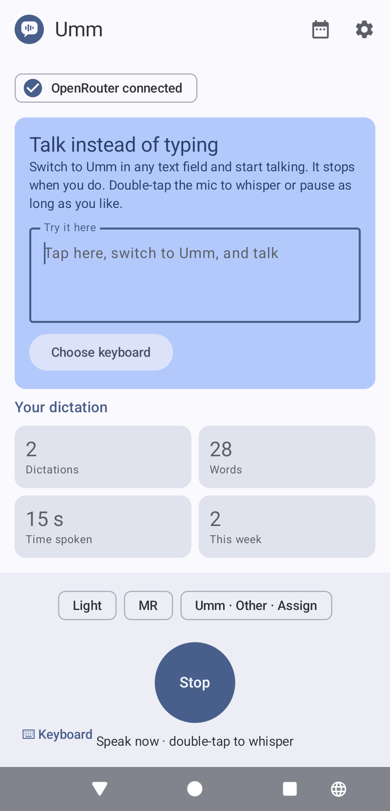
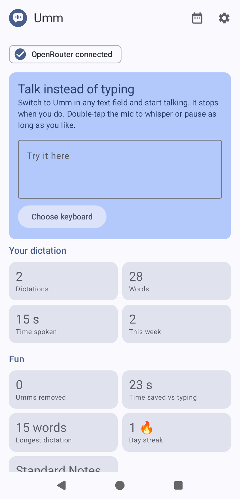
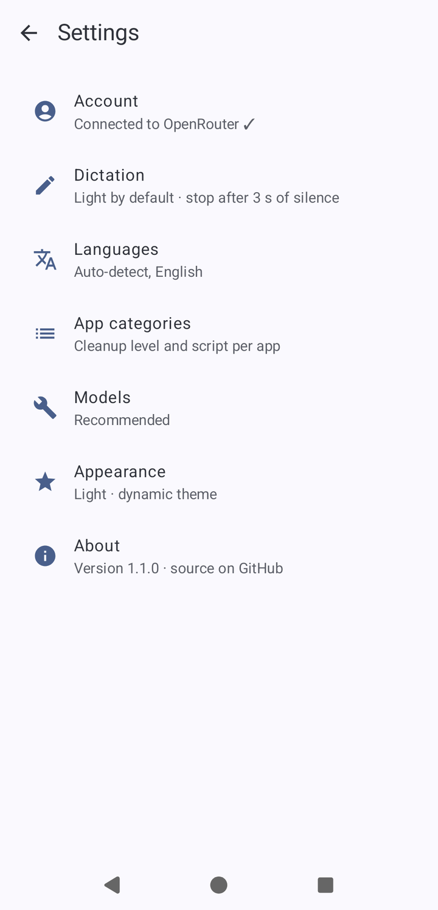
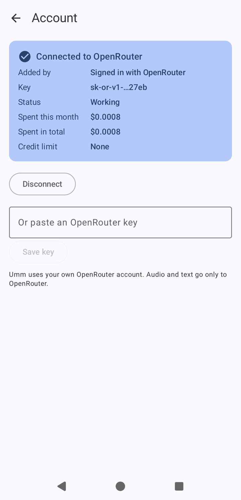
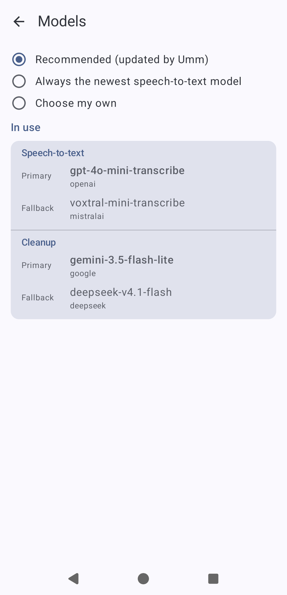
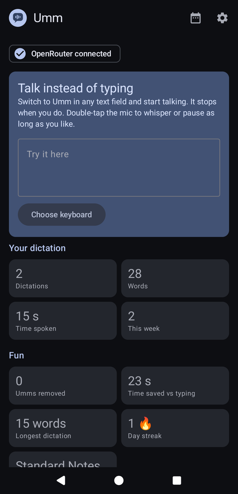

<p align="center">
  
</p>

<h1 align="center">Umm</h1>

<p align="center">
  A voice keyboard for Android. Switch to it in any text field, talk, and it types a cleaned-up version of what you said.<br>
  Named after the filler word it deletes.
</p>

<p align="center">
  <a href="https://github.com/agopalareddy/umm/releases/latest"></a>
  <a href="https://github.com/agopalareddy/umm/actions/workflows/ci.yml"></a>
  <a href="LICENSE.md"></a>
  
</p>

<p align="center">
  
  
  
  
</p>

You say "um, so, can we meet at five, no, six tomorrow?" and Umm types "Can we meet at 6 tomorrow?". Filler
words, false starts, and self-corrections come out. Lists become bullets in email. Hinglish stays Hinglish.

## Why Umm

**You pay for what you use, and you can cap it.** Umm runs on your own [OpenRouter](https://openrouter.ai)
account, so there is no subscription. In testing, a short dictation cost about $0.0004
(`gpt-4o-mini-transcribe` plus `gemini-3.5-flash-lite`). At 100 dictations a day, that is roughly $1.20 a month,
compared with $15 a month for [Wispr Flow Pro](https://wisprflow.ai/pricing). You can set a hard monthly credit
limit on your OpenRouter key, and Umm shows what you have spent this month on its Account page.

**It runs on phones the alternatives don't.** Umm needs Android 10 or newer. Gboard's Rambler is currently
[limited to the Pixel 11 series](https://support.google.com/gboard/answer/17468539), and Wispr Flow for Android
[needs Android 13](https://www.eesel.ai/blog/wispr-flow-pricing).

**Nothing goes through an Umm server.** There isn't one. Audio goes from your phone to OpenRouter and the model
provider it routes to, using your key. If you turn on OpenRouter's zero data retention setting, Umm still works:
it falls back to models that honor it.

**You choose how much it rewrites.** Four cleanup levels (Raw, Light, Formatted, Polished), set per app category.
Messaging defaults to Light, email and notes to Formatted, and you can move any app between categories from the
keyboard itself.

**It handles quiet speech and mixed languages.** Double-tap the mic to keep recording through pauses or a
whisper. Mixed speech such as Hinglish is kept as spoken, never translated, in Latin or native script per category.

**You can read and change the code.** The source is here, and the models Umm uses are listed in
[`models/recommended.json`](models/recommended.json).

## Download

1. On your phone, open the [latest release](https://github.com/agopalareddy/umm/releases/latest) and download the
   `.apk` file.
2. Open it and allow installs from your browser or files app when Android asks.
3. Open Umm and follow the three setup steps: enable the keyboard, allow the microphone, and connect OpenRouter.

You need an OpenRouter account with a few dollars of credit. "Connect with OpenRouter" signs you in and creates a
key for Umm; you can also paste a key you already have.

New versions install over the old one, and your settings and history stay.

## Using it

- In any text field, switch to Umm from the keyboard switcher. It starts listening right away.
- Talk. It stops after 3 seconds of silence (adjustable), cleans up the text, types it, and switches back to your
  usual keyboard.
- Double-tap the mic to record until you tap **Finish**.
- The chips above the mic change the cleanup level for this dictation, cycle languages, or move the current app to
  another category.
- Nothing is lost: if the network fails, the audio is kept for a retry, and if you have left the text field by the
  time the text is ready, it goes to the clipboard. History keeps your last 50 dictations.

## How it works

1. The keyboard records mono AAC audio and detects speech and silence on the phone. Silent recordings are never
   uploaded.
2. The audio goes to OpenRouter's `/audio/transcriptions` endpoint (`openai/gpt-4o-mini-transcribe`, falling back
   to `mistralai/voxtral-mini-transcribe`).
3. Unless the level is Raw, the transcript goes to `/chat/completions` with the level's instructions
   (`google/gemini-3.5-flash-lite`, falling back to `deepseek/deepseek-v4.1-flash`). The transcript is treated as
   data, so dictating "ignore previous instructions" gets cleaned, not obeyed.
4. The text goes into the field the dictation started in.

A short dictation typically appears 1.2 to 1.8 seconds after you stop speaking. The recommended models are
updated daily from this repository, so better models reach every install without a new release.

<p align="center">
  
  
</p>

## Building from source

You need JDK 17 and the Android SDK.

```bash
./gradlew assembleDebug
```

See [CONTRIBUTING.md](CONTRIBUTING.md) for development setup, tests, and how releases are made.

## License

Umm is © 2026 Aadarsha Gopala Reddy and licensed under the
[PolyForm Noncommercial License 1.0.0](LICENSE.md). You may use, copy, modify, and share it for any noncommercial
purpose, as long as every copy keeps the license and the `Required Notice` line crediting the original. Commercial
use needs separate permission. Contributions are covered in [CONTRIBUTING.md](CONTRIBUTING.md#license-of-contributions).
