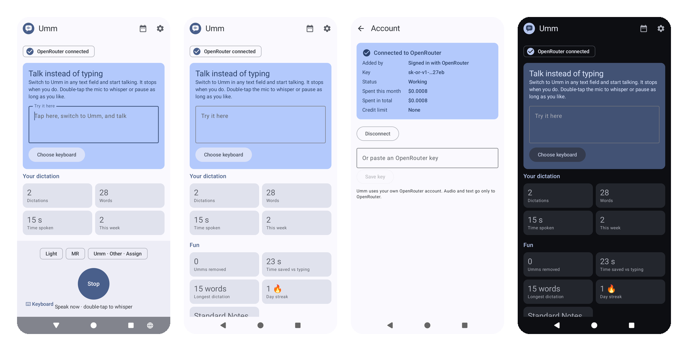

# Umm



[](https://github.com/agopalareddy/umm/releases/latest)
[](https://github.com/agopalareddy/umm/actions/workflows/ci.yml)
[](LICENSE.md)
[](#dependencies)
[](https://github.com/RichardLitt/standard-readme)

A voice keyboard for Android that types a cleaned-up version of what you say, using your own OpenRouter key.

Switch to Umm in any text field and talk. Filler words, false starts, and self-corrections come out; lists become
bullets in email; Hinglish stays Hinglish. It is named after the filler word it deletes.

## Table of Contents

- [Background](#background)
- [Install](#install)
  - [Dependencies](#dependencies)
  - [Updating](#updating)
- [Usage](#usage)
- [How it works](#how-it-works)
- [Privacy](#privacy)
- [Building from source](#building-from-source)
- [Maintainers](#maintainers)
- [Contributing](#contributing)
- [License](#license)

## Background

I wanted the voice typing that Wispr Flow and Gboard's Rambler offer, on my own terms: paid per use, on any
recent Android phone, with a say in which models do the work.

**You pay for what you use, and you can cap it.** Umm runs on your own [OpenRouter](https://openrouter.ai)
account, so there is no subscription. In testing, a short dictation cost about $0.0004
(`gpt-4o-mini-transcribe` plus `gemini-3.5-flash-lite`). At 100 dictations a day, that is roughly $1.20 a month,
compared with $15 a month for [Wispr Flow Pro](https://wisprflow.ai/pricing). You can set a hard monthly credit
limit on your OpenRouter key, and Umm shows what you have spent this month on its Account page.

**It runs on phones the alternatives don't.** Umm needs Android 10 or newer. Gboard's Rambler is currently
[limited to the Pixel 11 series](https://support.google.com/gboard/answer/17468539), and Wispr Flow for Android
[needs Android 13](https://www.eesel.ai/blog/wispr-flow-pricing).

**Nothing goes through an Umm server.** There isn't one. Audio goes from your phone to OpenRouter and the model
provider it routes to, using your key.

**You choose how much it rewrites.** Four cleanup levels (Raw, Light, Formatted, Polished), set per app category.
Messaging defaults to Light, email and notes to Formatted, and you can move any app between categories from the
keyboard itself.

**It handles quiet speech and mixed languages.** Double-tap the mic to keep recording through pauses or a
whisper. Mixed speech such as Hinglish is kept as spoken, never translated, in Latin or native script per category.

**You can read and change the code.** The models Umm uses are listed in
[`models/recommended.json`](models/recommended.json) and update daily from this repository, so better models reach
every install without a new release.

## Install

Download the latest `umm-<version>.apk` from [Releases](https://github.com/agopalareddy/umm/releases/latest) on
your phone, open it, and allow installs from your browser or files app when Android asks.

Or install it from a computer with USB debugging on:

```bash
adb install umm-1.1.0.apk
```

Then open Umm and follow the three setup steps: enable the keyboard, allow the microphone, and connect OpenRouter.
"Connect with OpenRouter" signs you in and creates a key for Umm; you can also paste a key you already have.

### Dependencies

- A phone running Android 10 or newer.
- An [OpenRouter](https://openrouter.ai) account with a few dollars of credit.

### Updating

Install the new APK over the old one. Your settings, history, and stats stay. Each release lists the SHA-256 of the
signing certificate; updates only install over a copy signed with the same key.

## Usage

In any text field, switch to Umm from the keyboard switcher (or tap the "Try it here" box on Umm's home screen).
It starts listening right away. When you stop talking, it cleans up the text, types it, and switches back to your
usual keyboard.

```text
You say:    "Um, so, can we meet at five, no, six tomorrow?"
Umm types:  "Can we meet at 6 tomorrow?"
```

- It stops after 3 seconds of silence. Change that in Settings → Dictation.
- Double-tap the mic to keep recording until you tap **Finish**.
- The chips above the mic change the cleanup level for this dictation, cycle languages, or move the current app to
  another category.
- If the network fails, the audio is kept for a retry. If you have left the text field by the time the text is
  ready, it goes to the clipboard. History keeps your last 50 dictations.

## How it works

1. The keyboard records mono AAC audio and detects speech and silence on the phone. Silent recordings are never
   uploaded.
2. The audio goes to OpenRouter's `/audio/transcriptions` endpoint (`openai/gpt-4o-mini-transcribe`, falling back
   to `mistralai/voxtral-mini-transcribe`).
3. Unless the level is Raw, the transcript goes to `/chat/completions` with the level's instructions
   (`google/gemini-3.5-flash-lite`, falling back to `deepseek/deepseek-v4.1-flash`). The transcript is treated as
   data, so dictating "ignore previous instructions" gets cleaned, not obeyed.
4. The text goes into the field the dictation started in.

A short dictation typically appears 1.2 to 1.8 seconds after you stop speaking.

## Privacy

The full [privacy policy](https://agopalareddy.github.io/umm/privacy/) is short. In summary:

- Umm has no server, account, analytics, or tracking.
- Audio and text go only to OpenRouter, with your key. Turn on "Zero data retention only" in Settings → Models to
  use only providers that don't keep your data. If your OpenRouter account already requires it, Umm detects that,
  tells you, and switches automatically.
- Your key is encrypted on the phone with an Android Keystore key and is never logged.
- History, stats, and any audio kept for a retry stay on the phone. Retry audio is deleted once it succeeds, or
  after 7 days.

## Building from source

You need JDK 17 and the Android SDK.

```bash
./gradlew assembleDebug
```

[CONTRIBUTING.md](CONTRIBUTING.md) covers development setup, tests, and how releases are made.

## Maintainers

[@agopalareddy](https://github.com/agopalareddy) · [agr@agreddy.com](mailto:agr@agreddy.com)

## Contributing

Questions and bug reports go in [GitHub Issues](https://github.com/agopalareddy/umm/issues). Pull requests are
welcome; for anything larger than a bug fix, open an issue first. See [CONTRIBUTING.md](CONTRIBUTING.md) for setup,
tests, commit style, and the license terms for contributions.

## License

[PolyForm-Noncommercial-1.0.0](LICENSE.md) © 2026 Aadarsha Gopala Reddy

You may use, copy, modify, and share Umm for any noncommercial purpose, as long as every copy keeps the license and
the `Required Notice` line crediting the original. Commercial use needs separate permission.
